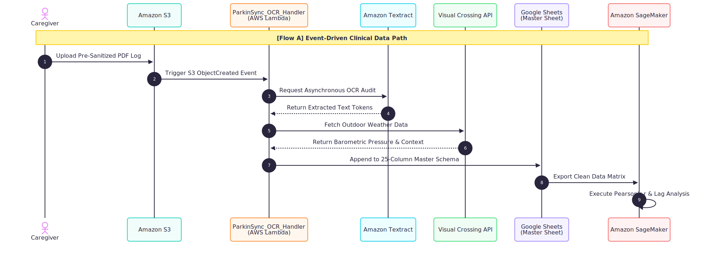
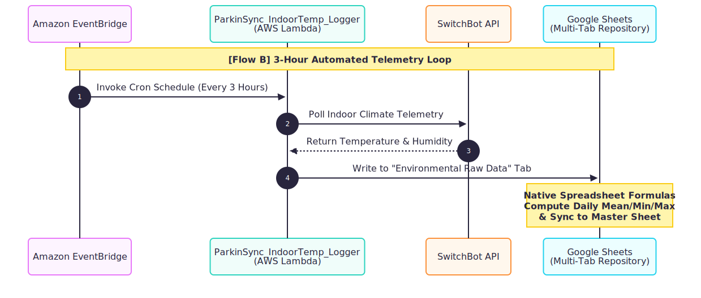

# ParkinSync v1.3.0: Hybrid Serverless Ingestion & Clinical Analytics Pipeline

## 📝 Project Overview
**ParkinSync** is a clinical-grade, serverless data engineering pipeline designed to bridge the gap between traditional paper-based clinical logging and advanced cloud analytics for Parkinson's Disease care. Optimized for environments facing physical and digital friction (such as rural care settings), the system synchronizes qualitative caregiver observations with continuous, high-fidelity environmental telemetry. 

To guarantee **100% Data Integrity** for medical informatics, v1.3.0 implements a robust **Human-in-the-Loop (HITL)** architecture, bypassing the 57% accuracy limitations of autonomous handwritten OCR by enforcing deterministic manual pre-sanitization prior to cloud ingestion.

## 🚀 Key Features

* **Human-in-the-Loop (HITL) Integrity:** Leverages an optimized analog paper interface for elderly caregivers, transitioning into a human-verified data entry step to eliminate the "Garbage In, Garbage Out" (GIGO) phenomenon before AWS ingestion.
* **Decoupled Dual-Lambda Core:** Splitting backend orchestration into two dedicated, isolated AWS Lambda functions (`ParkinSync_OCR_Handler` and `ParkinSync_IndoorTemp_Logger`) to ensure operational continuity and zero resource contention.
* **Schedule-Driven IoT Polling:** Employs an Amazon EventBridge cron routine to query the SwitchBot Open API every three hours, securing continuous indoor climate logs separate from active user uploads.
* **Hyper-Local Meteorological Enrichment:** Queries the Visual Crossing Weather API dynamically based on the historical event date written in the log, tracking environmental triggers (e.g., barometric pressure drops) that influence motor fluctuations.
* **Spreadsheet-Native Aggregation Layer:** Offloads heavy mathematical metrics (Daily Mean, Minimum, and Maximum environmental statistics) to a multi-tab Google Sheets calculation layout, significantly reducing serverless compute runtime and cloud operational costs.
* **Enterprise-Grade Security:** Enforces the Principle of Least Privilege (PoLP) via scoped IAM roles and completely eliminates hardcoded credentials by managing all API tokens and Google Service Accounts within **AWS Secrets Manager**.
* **Clinical Analytics Ready:** Normalizes disparate streams into a unified 25-column standardized schema, providing a pristine data matrix ready for Pearson's r correlation and lag-variable analysis in **Amazon SageMaker**.


## 📊 Google Sheets Dependency Configuration

To optimize serverless execution parameters and maintain a zero-cost cloud aggregate architecture, the system offloads telemetry summarization to spreadsheet-native calculation formulas before SageMaker analysis.

To bridge the gap between human readability (HITL) and machine learning readiness, the repository enforces dual-layer formula processing:

### 🤖 1. Analytics Layer (Structured for Python Pandas Parsing)
Environmental metrics are split into three independent numeric columns to preserve strict data atomicity:

*   **Daily Average Temperature Column:**
```excel
    =IFERROR(LET(raw_val, B2, clean_date_str, IFERROR(REGEXEXTRACT(raw_val, "\d{4}/\d{1,2}/\d{1,2}"), YEAR(TODAY()) & REGEXEXTRACT(raw_val, "/\d{1,2}/\d{1,2}")), target_date, DATEVALUE(clean_date_str), VLOOKUP(target_date, SwitchBot_hist_daily!A:D, 2, FALSE)), "")
 ```
*   **Daily Minimum Temperature Column:**
```excel
    =IFERROR(LET(raw_val, B2, clean_date_str, IFERROR(REGEXEXTRACT(raw_val, "\d{4}/\d{1,2}/\d{1,2}"), YEAR(TODAY()) & REGEXEXTRACT(raw_val, "/\d{1,2}/\d{1,2}")), target_date, DATEVALUE(clean_date_str), VLOOKUP(target_date, SwitchBot_hist_daily!A:D, 3, FALSE)), "")
 ```
*   **Daily Maximum Temperature Column:**
```excel
    =IFERROR(LET(raw_val, B2, clean_date_str, IFERROR(REGEXEXTRACT(raw_val, "\d{4}/\d{1,2}/\d{1,2}"), YEAR(TODAY()) & REGEXEXTRACT(raw_val, "/\d{1,2}/\d{1,2}")), target_date, DATEVALUE(clean_date_str), VLOOKUP(target_date, SwitchBot_hist_daily!A:D, 4, FALSE)), "")
 ```


### 🏠 2. Human-Centric UI Layer (Structured for Caregiver Dashboard)
Aggregates telemetry records into a single formatted string to provide immediate visibility for the home-care verification cycle:

*   **Consolidated Climate Dashboard Formula:**
```excel
    =IFERROR(
      LET(
        raw_val, B2,
        clean_date_str, IFERROR(REGEXEXTRACT(raw_val, "\d{4}/\d{1,2}/\d{1,2}"), YEAR(TODAY()) & REGEXEXTRACT(raw_val, "/\d{1,2}/\d{1,2}")),
        target_date, DATEVALUE(clean_date_str),
        avg, VLOOKUP(target_date, SwitchBot_hist_daily!A:D, 2, FALSE),
        min, VLOOKUP(target_date, SwitchBot_hist_daily!A:D, 3, FALSE),
        max, VLOOKUP(target_date, SwitchBot_hist_daily!A:D, 4, FALSE),
        "🏠 Avg:" & ROUND(avg, 1) & " / Min:" & ROUND(min, 1) & " / Max:" & ROUND(max, 1)
      ),
      "No Data"
 ```

## 🏗 System Architecture
The system follows a highly resilient, decoupled architecture separating event-driven clinical ingestion from schedule-driven environmental telemetry across three distinct operational layers.

### Overall Block Diagram


The pipeline operationalizes these steps using robust AWS cloud primitives:
* **Storage:** Amazon S3 (Ingestion staging bucket and archive)
* **Compute:** AWS Lambda (Python 3.12, decoupled micro-functions)
* **Scheduling:** Amazon EventBridge (3-hour automated cron execution)
* **OCR / Audit:** Amazon Textract (Form-based key-value parsing for system validation)
* **Database & Aggregation:** Google Sheets API v4 (Staging and Master Ledger)
* **Secrets Governance:** AWS Secrets Manager
* **Analytics Engine:** Amazon SageMaker (Python Pandas / NumPy correlation suite)

---

### Data Pipeline Execution Flows (Sequence Diagrams)

To maintain low latency and eliminate resource contention, execution lifecycles are entirely split into two independent processing timelines:

#### 1. Flow A: Event-Driven Clinical Data Path
This lifecycle handles the manual caregiver transcription uploads, triggering immediate external weather enrichment and appending verified lines to the master repository.


#### 2. Flow B: Schedule-Driven Environmental Telemetry Loop
This lifecycle runs completely in the background every three hours, pulling indoor metadata into a staging sheet where native formulas compile daily summaries without expanding serverless compute hour costs.



## 📁 Directory Structure
The repository is organized under a strict Software Configuration Management (SCM) hierarchy to ensure full reproducibility:
* `/analytics` : Contains v1.3.0 sample datasets and analytical scripts optimized for SageMaker ingestion.
* `/architecture` : High-resolution system block diagrams and sequence chart maps.
* `/design` : Bounded analog caregiver log templates and 25-column master schema data definitions.
* `/docs` : System documentation, deployment guides, and project compliance parameters.
* `/src` : Production Python source code for AWS Lambda functions (`lambda_function.py`, `indoor_temp_logger.py`).
* `/tests` : Automated unit testing and integration suite parameters.

## 🏁 Getting Started

### Prerequisites
* Python 3.12+
* AWS CLI configured with administrative/appropriate IAM permissions.
* Google Cloud Platform (GCP) Service Account credentials JSON.

### Installation & Deployment
1. Clone the master repository:
```bash
   git clone [https://github.com/larai-w/ParkinSync.git](https://github.com/larai-w/ParkinSync.git)
```

2. Navigate to the active staging branch:

```bash
   git checkout development
```

3. Deployment commands for packaging zip archives and updating live code arrays can be reviewed in detail within Appendix A of the system specification report.

## 🔒 Security, Ethics & Privacy
* Principle of Least Privilege (PoLP): Execution roles are explicitly constrained to required S3 buckets and Sheets targets.

* Data Anonymization: Personally Identifiable Information (PII) is omitted at the ingestion perimeter to maintain strict patient/caregiver clinical privacy.

* Zero-Hardcoding Guardrails: All critical service keys (Google Cloud JSON credentials, SwitchBot developer keys, and Visual Crossing API tokens) are strictly stored and rotated inside AWS Secrets Manager.

## 🌿 Branching Strategy
* main: Reserved exclusively for fully validated, stable production releases matching live AWS deployments. 
* development: Used for active iteration, dependency staging, and feature verification testing.

## License: 
This project is licensed under the MIT License - see the LICENSE file for details.

## Author: 
**larai-w** — MSIT Candidate, University of the People (Department of Computer Science & MSIT)
