# ParkinSync

## System Architecture

The system uses an event-driven serverless architecture on AWS (us-east-1). 
Key components include S3 for ingestion, Lambda for processing, and Textract for OCR.
